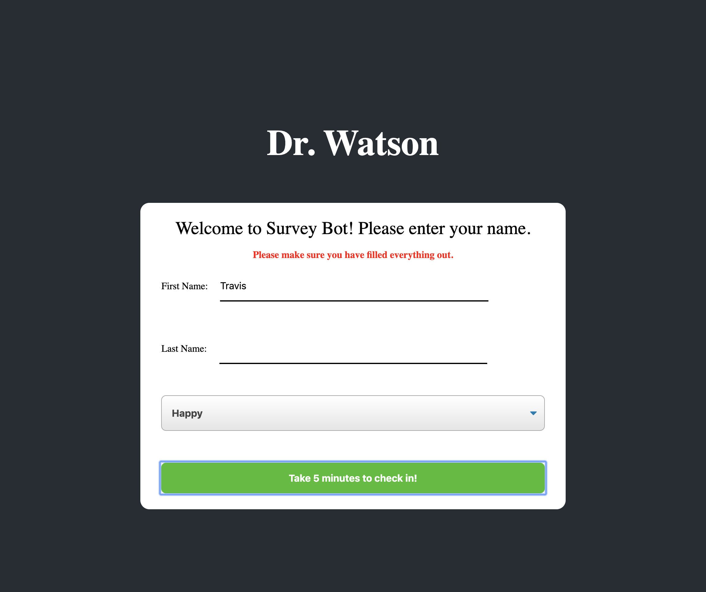

## Dr Watson 

### Set Up

Clone down this repo, install the dependencies, and start up the application using `npm start`.

You can run existing tests with `npm test`.

### Expectations / Rules

We currently have an Chat application using the [Watson Assistant API](https://cloud.ibm.com/docs/services/assistant?topic=assistant-api-overview).  The purpose of this application is to replace the surveys that students fill out every week.  We are still working on the API so conversations are short currently, but it will respond back based on your feedback.  We have the backend setup, but are having a few bugs/errors in the frontend.  We would like you to go through and fix the bugs, update the tests, and implement a new feature on it as well.

You will have 3 hours to work on this.

#### Dr Watson Login Screenshot (with error)

#### Dr Watson Chat Screenshot

**Important Note:** *There might be one or two things in the codebase that you might be unfamiliar with.  No worries, you will not need to understand how these work in order to pass this.  For example: do not worry about the `ref` or `createRef` inside of ChatBox or what is happening inside of `componentDidUpdate()`* 

### Iteration 1

Currently there is no verification to make sure that a user has filled out all of the inputs on the *WelcomeModal*.  If a user *checks in* with Dr. Watson without selecting a `feeling`, an error message comes up saying "Dr Watson is currently down. Please try again later."  Add in a check that the user has included a `firstName`, `lastName`, and `feeling` before the **handleSubmit** creates a newUser.  If one of the inputs is missing, utilize the `error` in state.  An error tag has been provided for you in the render.

### Iteration 2

Currently messages are being stored in local state in the `App` component.  Updates to that local state are handled by the **addMessage** and **clearMessages** methods.  We would like you to convert this over to the Redux global store.  Convert the methods to actions and add a new reducer called `messages` and connect them to the components that need access to that data/functionality.  

### Iteration 3

After successfully implementing your messages into Redux, write the tests for your new actions and `messages` reducer.  We have not created test files for actions and reducers yet, so please add them in.  Any changes you have made to containers, specifically with `mapStateToProps` and `mapDispatchToProps`, should also have updated tests. (some tests might already exist but need an update, others you might need to create)

### Iteration 4

Currently if you try to respond back to Dr Watson after his initial response, an error shows up saying "Cannot read property 'message' of undefined".  This is because the *postMessage* function in your `apiCalls` hasn't been completed.  Using the docs below, implement the fetch.  You should get a response back with a message object if the fetch is successful.  Return the message object in order to fix the error.

### Iteration 5

Let's continue to stick with our BDD process (Behavioral Driven Development) and now write our tests for our *postMessage* apiCall.  Add in a test that tests what url the fetch calls and incorporate happy and sad path tests.  You should be writing a total of 4 tests for the *postMessage* in order to test it fully. 

### Endpoints

Note that all of the endpoints require a header of "Content-Type" with a value of "application/json".

| Purpose | URL | Verb | Request Body | Sample Success Response |
|----|----|----|----|----|
| Start a conversation with Dr. Watson | `https://drwatson-api.herokuapp.com/api/v1/start_session` | POST | `{ "feeling": <String> }` | `{ "message": "Hello, I am Dr. Watson..." }` |
| Send a message to Dr. Watson and get a reply message back | `https://drwatson-api.herokuapp.com/api/message` | POST | `{ "message": <String> }` | `{ "message": "I appreciate the feedback..." }` |
| End the session with Dr. Watson | `https://drwatson-api.herokuapp.com/api/v1/end_session` | GET | none | 200 status code, no response body content |

Note: All of these endpoints will return semantic errors if something is wrong with the request.
